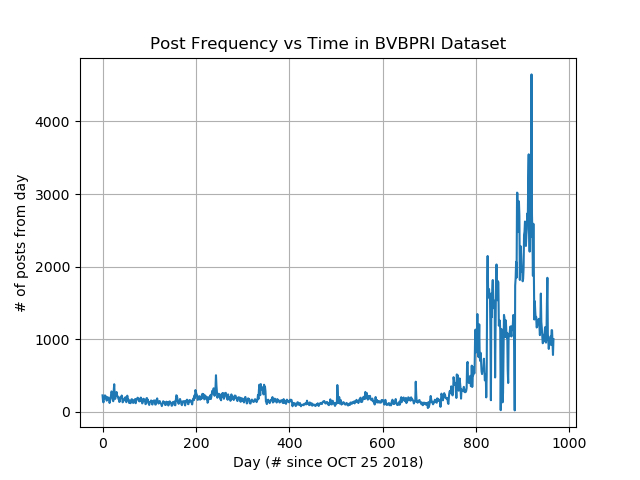
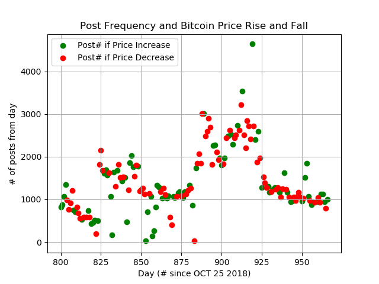

<h1 align="center"> Bitcoin-IGASS </h1>

* **
<h2 align="center"> Bitcoin Investment Growth Analysis through Similarity Scoring </h2>

* **
## Table of Contents
* **[File Structure](https://github.com/Sam-Chanow/Bitcoin-IGASS#file-structure)**
* **[Datasets](https://github.com/Sam-Chanow/Bitcoin-IGASS#datasets)**
* **[Model](https://github.com/Sam-Chanow/Bitcoin-IGASS#model)**
* **[Outcome](https://github.com/Sam-Chanow/Bitcoin-IGASS#outcome)**
* **[License](https://github.com/Sam-Chanow/Bitcoin-IGASS#copyright-and-license)**
* **
## File Structure
* **Bitcoin-IGASS/** - Main project directory
  * **data/** - Contains project datasets and data compilers
    * **compiled-datasets** - Labeled and ready to use datasets 
      * **BPRI** - Labeled price, to post dataset 
      * **BPRI-POSTSPLIT** -Modified BPRI dataset where posts are split by '/ENDPOST'
      * **BVBPRI** - Bert Vectorized compilation of the BPRI dataset. This stores each days worth of data as a labeled tensor is an individual file. This data is not in the github repository because it is around 90 GB.
      * **backup** -Backup zipped data
    * **raw-datasets** - The raw collected data from reddit and Bitcoin's price index
      * **backup** - Backup zipped data
      * **bitcoin-posts** - r/Bitcoin posts data
      * **bitcoin-price** - Bitcoin price data
      * **cryptocurrency-posts** - r/Cryptocurrency posts data
    * **data.py** - Provide and manipulate the compiled datasets
      * When run with option ```-post```, it can search by date through the whole r-cryptocurrency-posts dataset and return the posts from that date
      * When run with ```-price```, it can search by date and return price labels from a specified date
      * When used with ```-compile```, creates a dataset for the compiled-datasets folder
    * **postDownloader.py** - Manipulates the pushshift.io to retrieve reddit post data
  * **Images** - Contains graphs and images for the README
  * **model/** -Contains model information
    * **Net.py** - Torch model information 
  * **Predict.py** - Main python file to predict next days Bitcoin price data
    * **Usage:**
      * ```python3 predict.py -train```
      * ```python3 predict.py -predict FILE```, where FILE is the path to the file with the data in it.
  * **Readme.md** - Readme file
  * **dataset.py** - Iterable object that will read and parse all data from BPRI formatted files
  * **model.py** - The model used for price prediction. Can be run standalone to vectorize text data with Bert using the command ```python3 model.py - vector N```, where N is the number of iterations to skip before vectorizing.
* **
## Datasets
### Bitcoin Price by Reddit Indicators (BPRI) Dataset
**Purpose:**
This dataset correlates reddit posts from the subreddits r/Cryptocurrency and r/Bitcoin to the price change in Bitcoin the following day.

**Format:** [CHANGE] //POSTDATACOMPILED// [POST-DATA]

**Specifics:** [CHANGE] is the price change of Bitcoin (UP or DOWN) the day after the posts [POST-DATA] were posted in YYYY-MM-DD format. [POST-DATA] is a string that contains all of the post bodies from the given day concatenated and seperated by ' '. The dataset contains data from 2018-10-26 -> 2021-07-06.

### Bitcoin Price by Reddit Indicators Postsplit (BPRI-POSTSPLIT) Dataset
**Purpose:** This is the same data as the BPRI Dataset. This dataset correlates reddit posts from the subreddits r/Cryptocurrency and r/Bitcoin to the price change in Bitcoin the following day.

**Format:** [CHANGE] //POSTDATACOMPILED// [POST-DATA] /ENDPOST/ [POST-DATA] ...

**Specifics:** Everything in this dataset is the same as above, however the individual posts are separated by the /ENDPOST/ tag. [CHANGE] is the price change of Bitcoin (UP or DOWN) the day after the posts [POST-DATA] were posted in YYYY-MM-DD format. [POST-DATA] is a string that contains the post body of a post from the given day. The dataset contains data from 2018-10-26 -> 2021-07-06.

### Bert-Vectorized Bitcoin Price by Reddit Indicators (BVBPRI) Dataset
**Purpose:** Correlates Bitcoin price data with a list of tensors that are generated from Reddit post data pushed through BERT.

**Format:** The dataset is a collection of files named BVBPRI___.pt where ___is a number from 0 to 966. Each file contains a label, UP or DOWN and a list of tensors representing every post from that day.

**Specifics:** The data from each file can be loaded with ```L = torch.load('BVBPRI___.pt')```, and the data retrieved will be a 2d list where ```L[0]``` is the label, either UP or DOWN, and ```L[1]``` is a list of tensors.
* **
## Model
### Expected Data
* **BVBPRI Dataset**: Labeled lists of tensors.
### Learning Model
**Classifier**
* **RNN**: Possibly run this list of vectors through the RNN and train an RNN, maybe positional relationships will help the classifier.
* **Logistic Regression**: Most likely we will average or add all of those vectors and run it through a Logistic regression Model
* **

## Usage

TODO: Write about training the model with the given datasets

TODO: Write about creating your own dataset for training

TODO: Write about how to create daily test data

* **

## Outcome

**BVBPRI Dataset Size:**



* The post frequency in the last 100 days is hundreds of times higher than in the first 2/3 of the dataset.

**Post-Frequency / Price Correlation:**



* The graph above shows that there is no direct correlation between post frequency and price change

## Copyright and License
Copyright 2021 Samuel Chanow, Ryan Metz. Code released under [this LICENSE](LICENSE).
