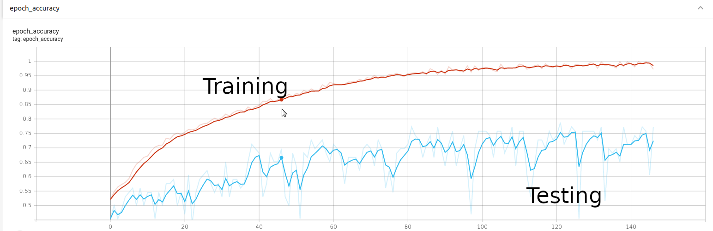

<h1 align="center"> Bitcoin-IGASS </h1>

* **
<h2 align="center"> Bitcoin Investment Growth Analysis through Similarity Scoring </h2>

* **

<h2 align="center">Purpose</h2>

The Bitcoin Investment Growth Analysis through Similarity Scoring project attempts to correlate Reddit posts in r/Cryptocurrency
and r/Bitcoin with the rise and fall of Bitcoin's price the following day.

* **
## Table of Contents
* **[File Structure](https://github.com/Sam-Chanow/Bitcoin-IGASS#file-structure)**
* **[Datasets](https://github.com/Sam-Chanow/Bitcoin-IGASS#datasets)**
* **[Model](https://github.com/Sam-Chanow/Bitcoin-IGASS#model)**
* **[Usage](https://github.com/Sam-Chanow/Bitcoin-IGASS#usage)**
* **[Outcome](https://github.com/Sam-Chanow/Bitcoin-IGASS#outcome)**
* **[License](https://github.com/Sam-Chanow/Bitcoin-IGASS#copyright-and-license)**
* **
## File Structure
* **Bitcoin-IGASS/** - Main project directory
    * **bin/** - Contains bash scripts to run prediction model
      * **build.sh** - builds a dataset (shouldn't be sued without care)
      * **evaluate.sh** - grabs post data from current day and gives prediction
      * **train.sh** - trains the tensorflow model
    * **data/** - Contains project datasets and data compilers
      * **compiled-datasets** - Labeled and ready to use datasets 
        * **BPRI** - Labeled price, to post dataset 
        * **BPRI-POSTSPLIT** -Modified BPRI dataset where posts are split by '/ENDPOST'
        * **BVBPRI** - Bert Vectorized compilation of the BPRI dataset. This stores each days worth of data as a labeled tensor is an individual file. This data is not in the github repository because it is around 90 GB.
        * **backup** -Backup zipped data
      * **raw-datasets** - The raw collected data from reddit and Bitcoin's price index
        * **backup** - Backup zipped data
        * **bitcoin-posts** - r/Bitcoin posts data
        * **bitcoin-price** - Bitcoin price data
        * **cryptocurrency-posts** - r/Cryptocurrency posts data
      * **data.py** - Provide and manipulate the compiled datasets
        * When run with option ```-post```, it can search by date through the whole r-cryptocurrency-posts dataset and return the posts from that date
        * When run with ```-price```, it can search by date and return price labels from a specified date
        * When used with ```-compile```, creates a dataset for the compiled-datasets folder
      * **postDownloader.py** - Manipulates the pushshift.io to retrieve reddit post data
    * **images/** - Contains graphs and images for the README
    * **logs/** - Tensorflow training logs (can be used with tensorboard)
    * **tensorflow_model/** -Contains model information
      * **tf_model.py** - the model used for prediction
      * **checkpoints** - saved model/weight configurations for reloading during prediction
    * **Predict.py** - Main python file to predict next days Bitcoin price data
    * **Usage:**
      * ```python3 predict.py -train```
      * ```python3 predict.py -predict FILE```, where FILE is the path to the file with the data in it.
    * **Readme.md** - Readme file
    * **dataset.py** - Iterable object that will read and parse all data from BPRI formatted files
    * **model.py** - The model used for price prediction. Can be run standalone to vectorize text data with Bert using the command ```python3 model.py - vector N```, where N is the number of iterations to skip before vectorizing.
    * **LICENSE** - Project License
    * **graphing.py** - SOme extra graphing functions with the dataset
* **
## Datasets
### Bitcoin Price by Reddit Indicators (BPRI) Dataset
**Purpose:**
This dataset correlates reddit posts from the subreddits r/Cryptocurrency and r/Bitcoin to the price change in Bitcoin the following day.

**Format:** [CHANGE] //POSTDATACOMPILED// [POST-DATA]

**Specifics:** [CHANGE] is the price change of Bitcoin (UP or DOWN) the day after the posts [POST-DATA] were posted in YYYY-MM-DD format. [POST-DATA] is a string that contains all of the post bodies from the given day concatenated and seperated by ' '. The dataset contains data from 2018-10-26 -> 2021-07-06.

### Bitcoin Price by Reddit Indicators Postsplit (BPRI-POSTSPLIT) Dataset
**Purpose:** This is the same data as the BPRI Dataset. This dataset correlates reddit posts from the subreddits r/Cryptocurrency and r/Bitcoin to the price change in Bitcoin the following day.

**Format:** [CHANGE] //POSTDATACOMPILED// [POST-DATA] /ENDPOST/ [POST-DATA] ...

**Specifics:** Everything in this dataset is the same as above, however the individual posts are separated by the /ENDPOST/ tag. [CHANGE] is the price change of Bitcoin (UP or DOWN) the day after the posts [POST-DATA] were posted in YYYY-MM-DD format. [POST-DATA] is a string that contains the post body of a post from the given day. The dataset contains data from 2018-10-26 -> 2021-07-06.

### Bert-Vectorized Bitcoin Price by Reddit Indicators (BVBPRI) Dataset
**Purpose:** Correlates Bitcoin price data with a list of tensors that are generated from Reddit post data pushed through BERT.

**Format:** The dataset is a collection of files named BVBPRI___.pt where ___is a number from 0 to 966. Each file contains a label, UP or DOWN and a list of tensors representing every post from that day.

**Specifics:** The data from each file can be loaded with ```L = torch.load('BVBPRI___.pt')```, and the data retrieved will be a 2d list where ```L[0]``` is the label, either UP or DOWN, and ```L[1]``` is a list of tensors.
* **
## Model
**Classifier**

Tensorflow 2.0 Neural Network Classifier.

5 Layers:

* Input layer
* 3 Dense layers with tanh activation
* Output layer of size 2 with softmax activation

**Parameters**:
* 60 epochs
* tanh activation
* learning rate: 0.001
* Adam Optimizer
* Using Keras callback, model with best validation set accuracy is saved and loaded for evaluation

**Output**:
* Vector of size 2, i.e. ```[0,1]```, which indicates the price went down. or the inverse which indicates the price went up.


* **

## Usage

IMPORTANT: YOU CANNOT RUN THE FILES INDEPENDENTLY. THEY MUST BE RUN FROM THE BASH SCRIPTS BECAUSE OF FILE PATHING

IMPORTANT: YOU MUST RUN THE BASH SCRIPTS INSIDE THE BIN FOLDER

IMPORTANT: BEFORE RUNNING ANY OF THESE SCRIPTS ENSURE THAT ALL LIBRARY DEPENDENCIES ARE MET, TENSORFLOW, KERAS, NUMPY, SKLEARN, ETC.

**Building the Dataset:**

Run ```build.sh``` and fill in any propmted information in the terminal. NOTICE: This will overwrite the data in the dataset directories.


**Training the Model:**

Run ```train.sh```

**Predicting Next Day Price Movement:**

Run ```evaluate.sh``` 

Enter these values when prompted:

1) ```../temp_evaluate/evaluateBPRI.bpri```
2) Today's date
3) Tomorrow's date
4) ```Y```
5) ```../temp_evaluate/evaluate_raw.txt```
6) ```../temp_evaluate/evaluate_raw_s.txt```
7) ```../temp_evaluate/evaluateBPRI.bpri```


* **

## Outcome

**BVBPRI Dataset Size:**


The post frequency in the last 100 days is hundreds of times higher than in the first 2/3 of the dataset.

**Post-Frequency / Price Correlation:**


The graph above shows that there is no direct correlation between post frequency and price change

**Training and Accuracy:**

**Initial testing:**


While it may appear at first that this initial testing provided a strong learning model, there was a flaw in our training pipeline.
the test data was always coming from the final 66 files of the BVBPRI dataset. The model was very confidant with recent data but if you exposed it to anything other than these last 66 days it dropped off dramatically.

**Attempted Models:**

This graph shows a few of the different tests we ran, these were all based on single hidden layer models and as you can see very much overfit to the training data.


**Final Model**


This is the training and test accuracy for the final model. The test accuracy oscillated between 52 and 65 but does obviously trend upwards.
With the accuracy of the training data epochs and the slow rise of the test data accuracy, we believe that a better accuracy could be obtained with more training data.

## Copyright and License
Copyright 2021 Samuel Chanow, Ryan Metz. Code released under [this LICENSE](LICENSE).
